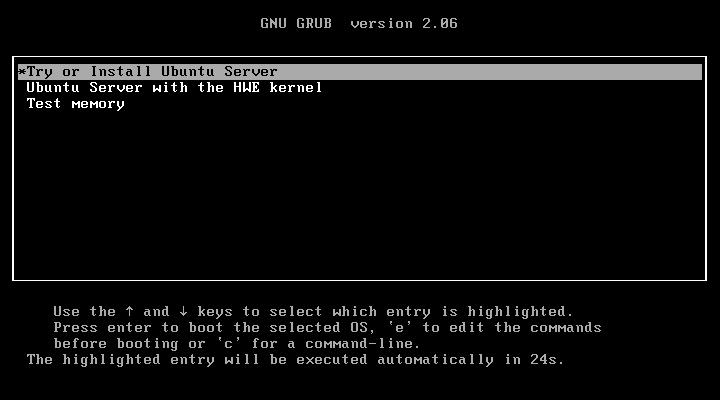
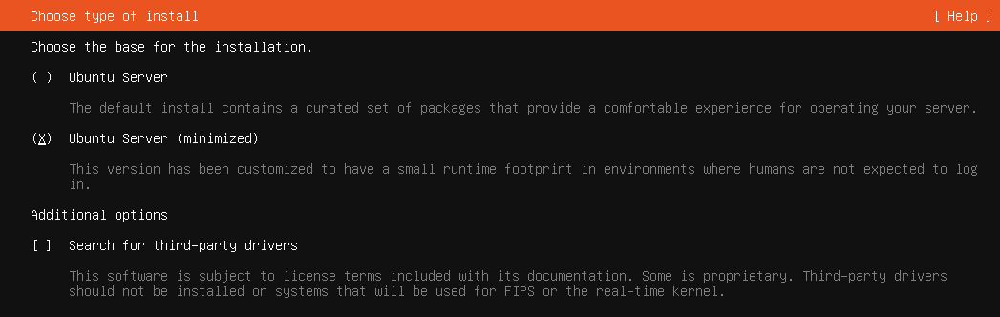
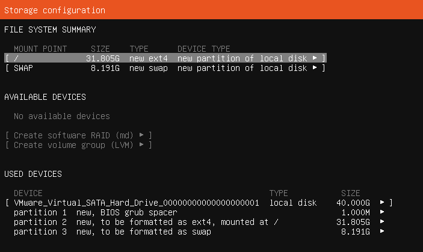
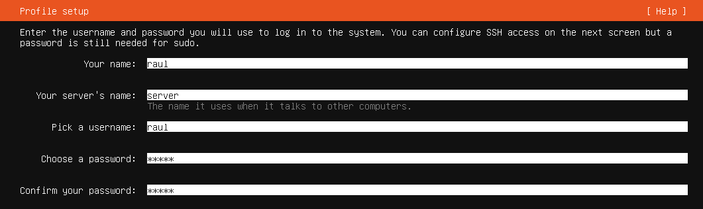
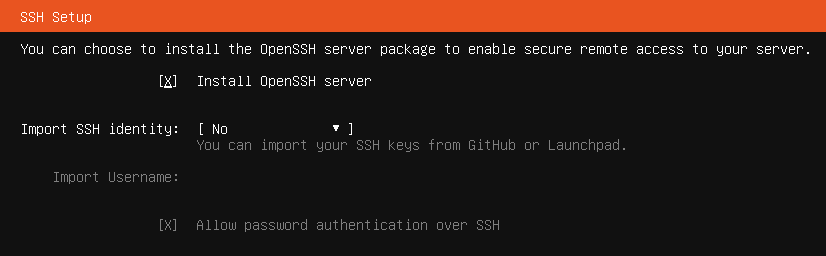
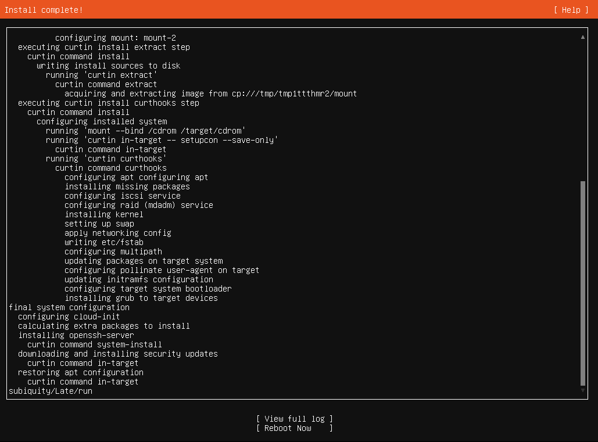
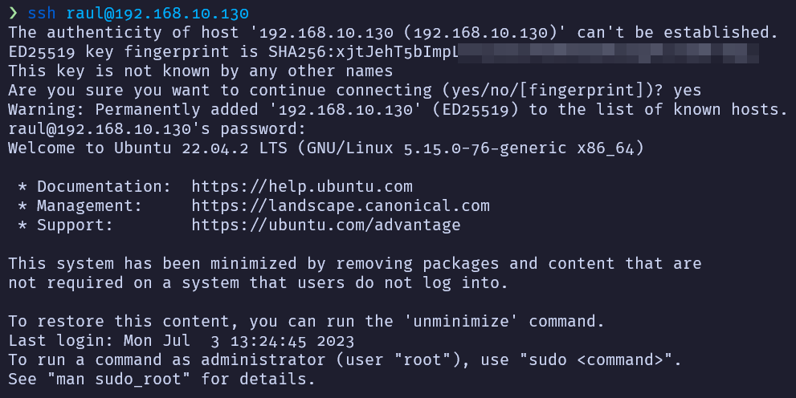
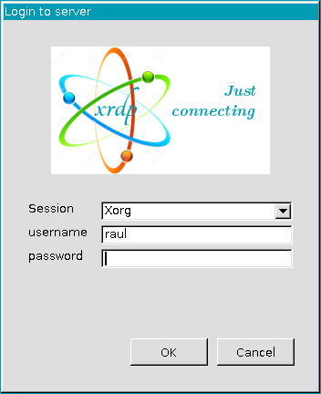
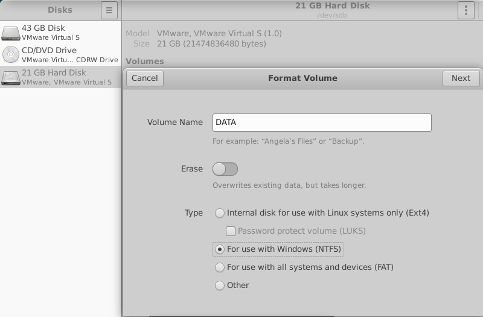
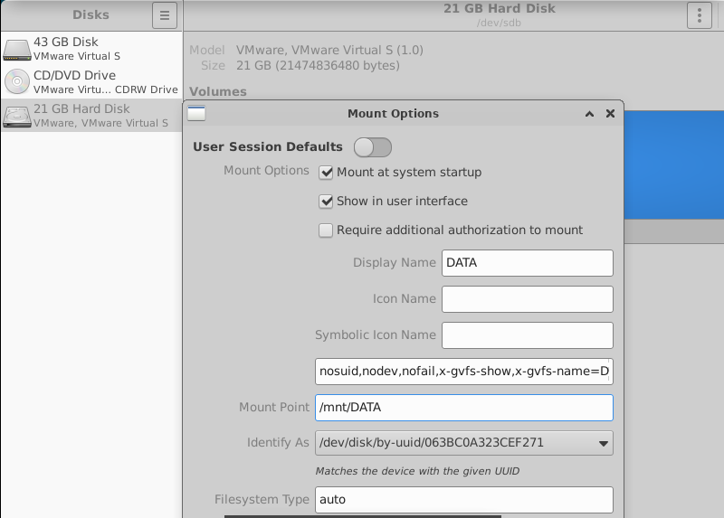

# Server

This is a repository of service configurations in docker compose for any server.

## Exposed Ports

List of the exposed ports in a server:

- 8: File-Broser
- 53: Pi-Hole DNS
- 80: Reverse Proxy HTTP
- 81: Nginx Proxy Manager Admin UI
- 88: Nextcloud
- 443: Reverse Proxy HTTPS
- 888: Odoo
- 3001: Uptime-Kuma
- 3333: Ghostfolio
- 4000: Blockscout HTTP
- 5353: Pi-Hole Admin UI
- 6379: Redis DB Blockscout
- 7432: Postgres DB Blockscout
- 7545: HardHat RPC
- 7777: Anaconda Jupyter
- 8000: Vaultwarden
- 8080: Traefik Admin UI
- 8096: Jellyfin HTTP
- 8200: Duplicati Admin UI
- 8443: Code Server
- 8545: Truffle Ganache RPC
- 8888: Wordpress
- 9000: Portainer HTTP
- 9443: Portainer HTTPS
- 19999: Netdata
- 51820: Wireguard VPN UDP

## Install

First, boot from the `Ubuntu Server` ISO.



In this case we only need the **minimized** server.



Format the disk in order to have enough space and `Swap`.



Configure the user, password and server's name.



Install `OpenSSH Server`.



Wait until the install is complete and restart.



## Configuration

### Network

After installing [Ubuntu Server](https://ubuntu.com/download/server), we can log in using SSH.



Then, update the packages to install **git** and **vim** _(or nano if you prefer)_.

```bash
$ sudo apt update

$ sudo apt install git vim
```

Edit the **netplan** file to configure the network settings.

```bash
$ sudo vim /etc/netplan/00-installer-config.yaml
```

This is the network configuration of this server.

```yaml
network:
  ethernets:
    ens33:
      addresses:
        - 192.168.10.130/24
      nameservers:
        addresses: [8.8.8.8, 1.1.1.1]
      routes:
        - to: default
          via: 192.168.10.1
  version: 2
```

Use the **netplan** command to apply the changes.

```bash
$ sudo netplan apply
```

Reboot the server to check everything is working.

```bash
$ sudo reboot now
```

### Setup

First, clone this _repository_ on the server and navigate to the directory.

```bash
$ git clone https://github.com/RaulSanchezzt/server.git && cd server
```

Give executable **permissions** to all _bash scripts_ in this directory.

```bash
$ chmod +x *.sh
```

Now you can run the **setup** script.

```bash
$ ./setup.sh
```

### Compose

Before running this script, open `VScode` on your browser _(http://server.local:8443)_ and edit the `.env` files of the services you want to install. Then, choose the services to install in the `compose.sh` script and run it!

```bash
$ ./compose.sh
```

## NextCloud

First, let's connect using RDP.



Then, format a new hard disk in _NTFS_.



Make sure to **mount at system startup** and rename it.



Create a new volume for all the data on the other hard disk:

```bash
# Create a new Folder
$ mkdir NextCloud

# Create external volume
$ docker volume create --opt type=none --opt o=bind --opt device=/mnt/DATA/NextCloud/ nextcloud
```

Finally, start the containers:

```bash
$ root@server:/home/administrator/server/nextcloud dcup
[+] Running 4/0
 ✔ Container Reverse-Proxy  Running                                                                                                                    0.0s
 ✔ Container MariaDB        Running                                                                                                                    0.0s
 ✔ Container Redis          Running                                                                                                                    0.0s
 ✔ Container App            Running                                                                                                                    0.0s
```

## Nginx Proxy Manager

To solve errors in **NextCloud**, copy and paste this in the **advanced settings** of the host.

```js
location /.well-known/carddav {
  return 301 $scheme://$host/remote.php/dav;}
location /.well-known/caldav {
  return 301 $scheme://$host/remote.php/dav; }
location /.well-known/webdav {
 return 301 $scheme://$host/remote.php/dav; }
```
