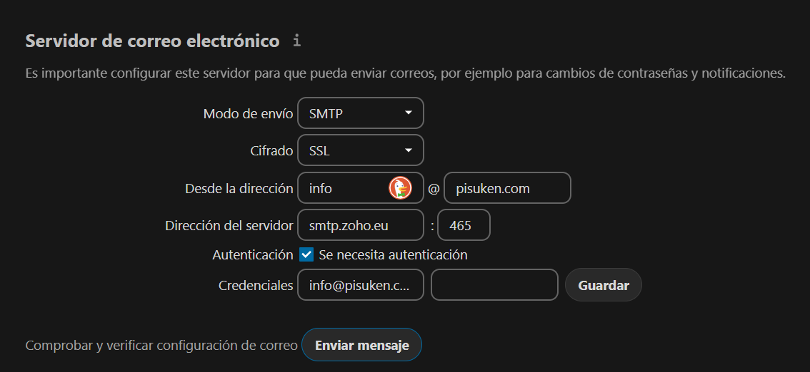

# Server

This is a repository of service configurations in docker compose for any server.

## Exposed Ports

List of the exposed ports in a server:

- 8: File-Broser
- 53: Pi-Hole DNS
- 80: Reverse Proxy HTTP
- 81: Nginx Proxy Manager Admin UI
- 88: Nextcloud
- 443: Reverse Proxy HTTPS
- 888: Odoo
- 3001: Uptime-Kuma
- 3333: Ghostfolio
- 4000: Blockscout HTTP
- 5353: Pi-Hole Admin UI
- 5678: n8n
- 6379: Redis DB Blockscout
- 7359: Jellyfin Service Discovery
- 7432: Postgres DB Blockscout
- 7545: HardHat RPC
- 7777: Anaconda Jupyter
- 8000: Vaultwarden
- 8080: Traefik Admin UI
- 8081: qBittorrent Web UI
- 8096: Jellyfin HTTP
- 8200: Duplicati Admin UI
- 8443: Code Server
- 8545: Truffle Ganache RPC
- 8888: Wordpress
- 9000: Portainer HTTP
- 9091: Transmission Web UI
- 9443: Portainer HTTPS
- 19999: Netdata
- 51413: Transmission BitTorrent Client
- 51820: Wireguard VPN UDP

## Install

First, boot from the `Ubuntu Server` ISO.


In this case we only need the **minimized** server.


Format the disk in order to have enough space and `Swap`.


Configure the user, password and server's name.


Install `OpenSSH Server`.


Wait until the install is complete and restart.


## Configuration

### Network

After installing [Ubuntu Server](https://ubuntu.com/download/server), we can log in using SSH.


Then, update the packages to install **git** and **vim** _(or nano if you prefer)_.

```bash
$ sudo apt update

$ sudo apt install git vim
```

Edit the **netplan** file to configure the network settings.

```bash
$ sudo vim /etc/netplan/00-installer-config.yaml
```

This is the network configuration of this server.

```yaml
network:
  ethernets:
    ens33:
      addresses:
        - 192.168.10.130/24
      nameservers:
        addresses: [8.8.8.8, 1.1.1.1]
      routes:
        - to: default
          via: 192.168.10.1
  version: 2
```

Use the **netplan** command to apply the changes.

```bash
$ sudo netplan apply
```

Reboot the server to check everything is working.

```bash
$ sudo reboot now
```

### Fail2Ban

If we are going to expose the **SSH** port to _internet_, make sure to use **fail2ban**. Edit the `jail.conf` file like this:

```bash
$ vim /etc/fail2ban/jail.conf
```

Move to the `JAILS` section and edit the settings:

```python
#
# JAILS
#

#
# SSH servers
#

[sshd]

# To use more aggressive sshd modes set filter parameter "mode" in jail.local:
# normal (default), ddos, extra or aggressive (combines all).
# See "tests/files/logs/sshd" or "filter.d/sshd.conf" for usage example and details.

enabled = true
bantime = 86400 # 24 Hours
port    = ssh
logpath = %(sshd_log)s
backend = %(sshd_backend)s
maxretry = 3
```

Then, **enable** the service and **start** the service.

```bash
$ sudo systemctl enable fail2ban

$ sudo systemctl start fail2ban

$ sudo systemctl status fail2ban
```

Now we can see the banned **IPs**:

```bash
cat /var/log/fail2ban.log
```

### Setup

First, clone this _repository_ on the server and navigate to the directory.

```bash
$ git clone https://github.com/RaulSanchezzt/server.git && cd server
```

Give executable **permissions** to all _bash scripts_ in this directory.

```bash
$ chmod +x *.sh
```

Now you can run the **setup** script.

```bash
$ ./setup.sh
```

### Compose

Before running this script, open `VScode` on your browser _(http://server.local:8443)_ and edit the `.env` files of the services you want to install. Then, choose the services to install in the `compose.sh` script and run it!

```bash
$ ./compose.sh
```

## Code Server

Secure **Visual Studio Code** using a strong `password` in the `.env` file, then restart the container.

## NextCloud

### Disks

First, let's connect using RDP.


Then, format a new hard disk in _NTFS_.


Following this [tutorial](https://developerinsider.co/auto-mount-drive-in-ubuntu-server-22-04-at-startup/) we can learn to automount the external drive at **startup**. First, create the Mount Point.

```bash
root@server:/media# mkdir BACKUP1
root@server:/media# mkdir BACKUP2
```

Then, get the Drive **UUID** and **Type**.

```bash
root@server:/media# lsblk -o NAME,FSTYPE,UUID,MOUNTPOINTS
NAME FSTYPE UUID                                 MOUNTPOINTS
sda
└─sda1
     ntfs   15A2E896213E30F6
sdb
└─sdb1
     ntfs   291D307A63875E89                     /media/DATA
sdc
└─sdc1
     ntfs   10873988671A6AD0
sdd
├─sdd1
│    vfat   D9E8-536B                            /boot/efi
├─sdd2
│    ext4   9667282e-8a54-4ea9-8622-46b12c461052 /var/snap/firefox/common/host-hunspell
│                                                /
└─sdd3
     swap   4fd8c3fc-a85b-49a1-ad87-529ba9becabd [SWAP]
```

Now, edit the `/etc/fstab` file.

```bash
# DATA
UUID=291D307A63875E89 /media/DATA ntfs defaults 0 0

# BACKUP1
UUID=15A2E896213E30F6 /media/BACKUP1 ntfs defaults 0 0

# BACKUP2
UUID=10873988671A6AD0 /media/BACKUP2 ntfs defaults 0 0
```

**Test** `fstab` before rebooting!

```bash
$ sudo findmnt --verify
Success, no errors or warnings detected
```

Reboot the server to check everything is working well.

```bash
$ sudo reboot now
```

Check the drive is mounted again.

```bash
$ lsblk -o NAME,FSTYPE,UUID,MOUNTPOINTS
NAME FSTYPE UUID                                 MOUNTPOINTS
sda
└─sda1
     ntfs   15A2E896213E30F6                     /media/BACKUP1
sdb
└─sdb1
     ntfs   291D307A63875E89                     /media/DATA
sdc
└─sdc1
     ntfs   10873988671A6AD0                     /media/BACKUP2
sdd
├─sdd1
│    vfat   D9E8-536B                            /boot/efi
├─sdd2
│    ext4   9667282e-8a54-4ea9-8622-46b12c461052 /var/snap/firefox/common/host-hunspell
│                                                /
└─sdd3
     swap   4fd8c3fc-a85b-49a1-ad87-529ba9becabd [SWAP]
```

Here we can see every drive is mounted after start so edit the volume settings in the `docker-compose.yml` to store the data in other hard disk.

Finally, start the containers:

```bash
$ root@server:/home/administrator/server/nextcloud dcup
[+] Running 4/0
 ✔ Container Reverse-Proxy  Running                                                                                                                    0.0s
 ✔ Container MariaDB        Running                                                                                                                    0.0s
 ✔ Container Redis          Running                                                                                                                    0.0s
 ✔ Container App            Running                                                                                                                    0.0s
```

### Post-Configurations

Enter to the `App` container as **root**.

```bash
$ docker exec -it App bash
```

Update and install `vim`.

```bash
$ root@f7ecbe790da1:/var/www/html# apt update
Hit:1 http://deb.debian.org/debian bookworm InRelease
Hit:2 http://deb.debian.org/debian bookworm-updates InRelease
Hit:3 http://deb.debian.org/debian-security bookworm-security InRelease
Reading package lists... Done
Building dependency tree... Done
Reading state information... Done
1 package can be upgraded. Run 'apt list --upgradable' to see it.

$ root@f7ecbe790da1:/var/www/html# apt install vim
Reading package lists... Done
Building dependency tree... Done
Reading state information... Done
vim is already the newest version (2:9.0.1378-2).
0 upgraded, 0 newly installed, 0 to remove and 1 not upgraded.
```

Edit `config.php` and paste this string:

`'check_data_directory_permissions' => false,`

```bash
$ root@f7ecbe790da1:/var/www/html# vim config/config.php
```

Exit and restart the container.

```bash
root@f7ecbe790da1:/var/www/html# exit
exit
root@server:/home/administrator/server/nextcloud# docker restart App
App
```

Execute the script to fix some warnings...

```bash
$ root@server:/home/administrator/server/nextcloud# ./config.sh
```

Configure the email server using **Zoho Mail**:



### Cron Error

To fix the cron error, first make sure **cron** is selected on the settings. Then, create a new **cronjob**.

```bash
root@server:/home/administrator# crontab -l
no crontab for root

root@server:/home/administrator# crontab -e
no crontab for root - using an empty one

Select an editor.  To change later, run 'select-editor'.
  1. /bin/nano        <---- easiest
  2. /usr/bin/vim.basic
  3. /usr/bin/vim.tiny
  4. /bin/ed

Choose 1-4 [1]: 1
```

Finally, paste this command to make sure the crontab jobs are working every **5 minutes**.

`*/5 * * * * docker exec -u www-data App php -f /var/www/html/cron.php`

## DuckDNS

It's a good practice to use a **Dynamic DNS** because the public **IP address** can change. Log in to [DuckDNS](https://www.duckdns.org/) and create a new domain pointing to the **actual IP address**.

Then, copy the `token` and paste it to the `.env` file and start the service.

Now if your **public IP address** changes, this service will update automatically.

## Domains

Once we have configured the **DynDNS**, let's create some `DNS Records` to access our services:


Finally, open the ports `80, 443 & 51820` on the **router** to make sure all service can work.

## Nginx Proxy Manager

If we want to access from **Internet** to some services, we have to configure the `Reverse Proxy`. Log in to the [web](http://server.local:81) using the [default credentials](https://nginxproxymanager.com/guide/#quick-setup). Immediately after logging in with this default user, modify your details and change your password.

Then, create some **SSL Certificates**, and following this [tutorial](https://youtu.be/qlcVx-k-02E), create one to access to our local home lab using **HTTPS**.


Create the necessary **Proxy Hosts** to their `destination`.


Change the **default site** to `404 page`.


To solve errors in **NextCloud**, copy and paste this in the **advanced settings** of the host.

```js
location /.well-known/carddav {
  return 301 $scheme://$host/remote.php/dav;}
location /.well-known/caldav {
  return 301 $scheme://$host/remote.php/dav; }
location /.well-known/webdav {
 return 301 $scheme://$host/remote.php/dav; }
```

## Vaultwarden

First, start the service and configure the **Reverse Proxy** to use `HTTPS`:

```bash
$ root@server:/home/administrator/server/vaultwarden# dcup
```

To [enable the admin page](https://github.com/dani-garcia/vaultwarden/wiki/Enabling-admin-page), generate an `Argon2id PHC` and paste the output in the `.env` file:

```bash
$ docker exec -it Vaultwarden /vaultwarden hash --preset owasp
```

Once we have the `ADMIN_TOKEN`, recreate the container:

```bash
$ root@server:/home/administrator/server/vaultwarden# dcup
```

Create a new account before edit the **Admin settings**. Navigate to the admin page and configure the **SMTP** settings:


Then, [disable registration of new users](https://github.com/dani-garcia/vaultwarden/wiki/Disable-registration-of-new-users) in the general settings:


Finally, enable the [email 2FA settings](https://bitwarden.com/help/setup-two-step-login-email/) and log in to your account and verify your **email**.


## Duplicati

First, edit the file to mount the **volumes**. Then, log in, set a **secure password** and create a new task or import other `configurations`.

## Wireguard

To make sure the **VPN** works always, put the `URL` of [DuckDNS](#duckdns) in the `docker-compose.yml`. Then, add the **peers** you need and start the service.

## Jellyfin

- Change qbittorrent theme ui
- Change default password of qbittorrent
- Change default password of filebrowser
